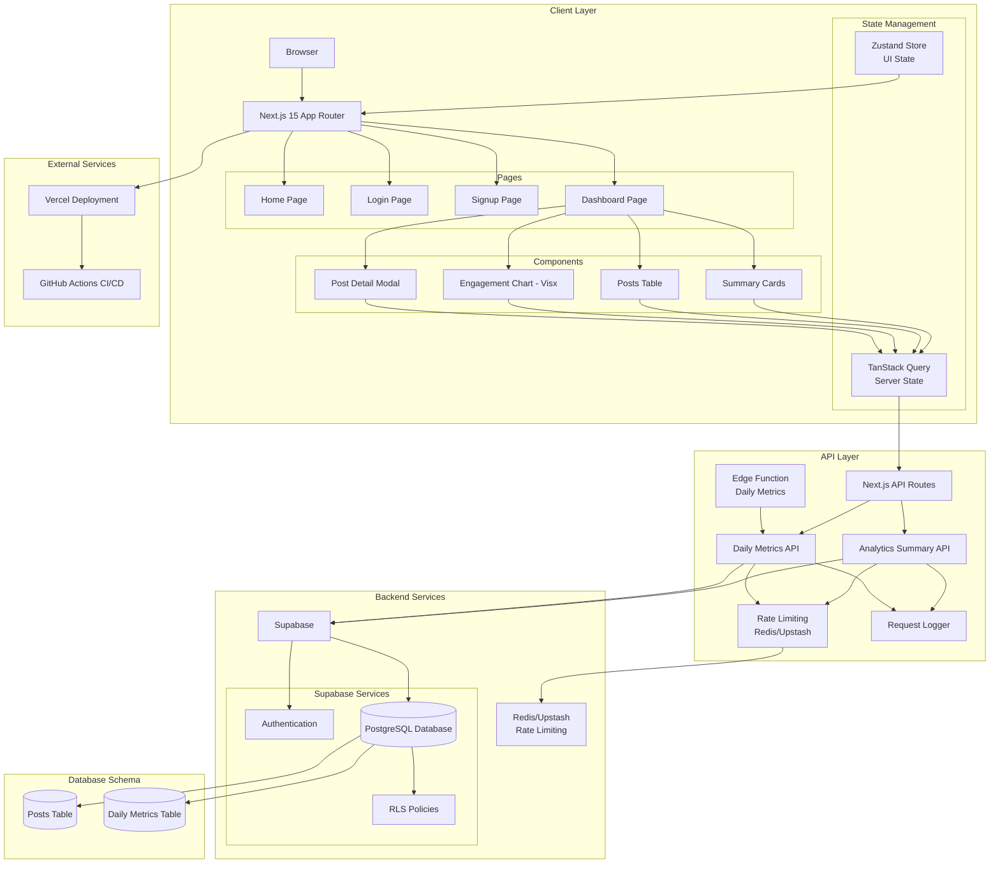
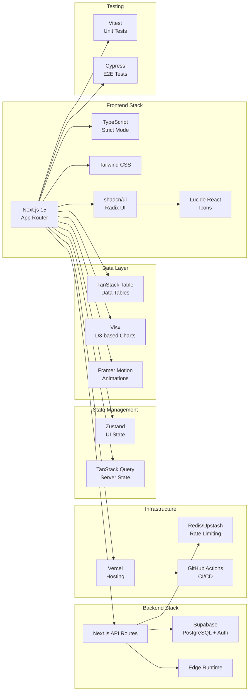
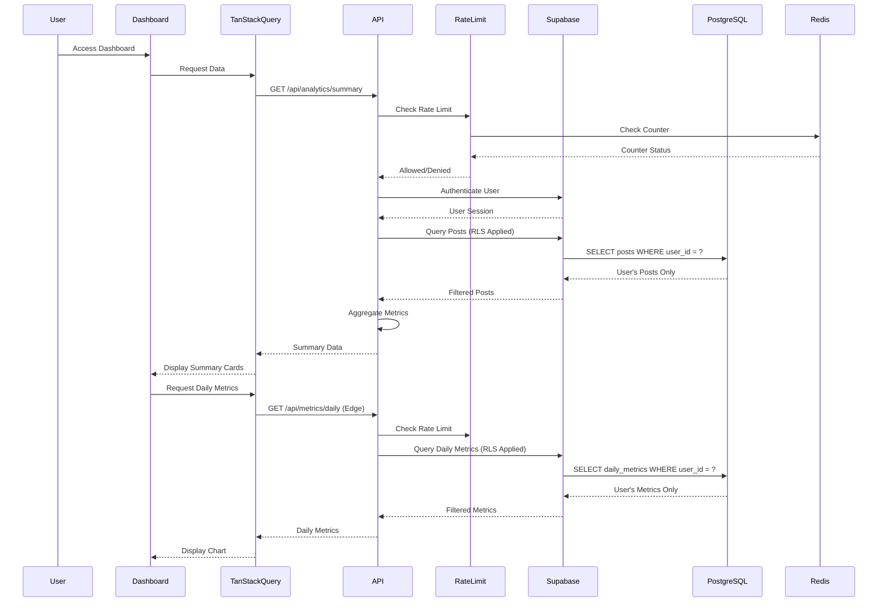
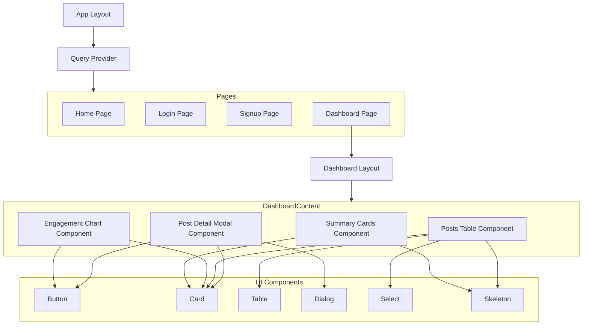
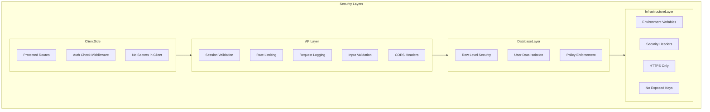
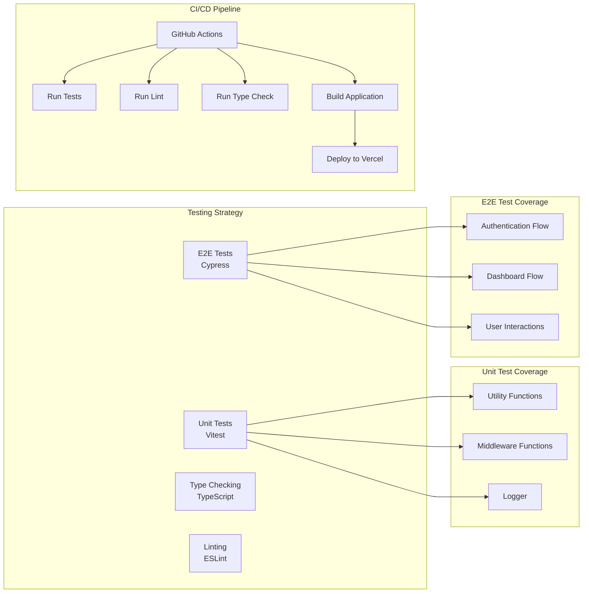

# Project Architecture

## System Architecture Diagram

## Technology Stack Diagram

## Feature Breakdown Diagram

```mermaid
graph TB
    Root[Social Media Analytics Dashboard]
    
    subgraph "Core Features"
        Auth[Authentication]
        PostsTable[Posts Table]
        Chart[Engagement Chart]
        Summary[Summary Cards]
        Modal[Post Detail Modal]
        
        Auth --> Auth1[Email/Password Login]
        Auth --> Auth2[Sign Up]
        Auth --> Auth3[Session Management]
        Auth --> Auth4[Protected Routes]
        
        PostsTable --> PT1[Sortable Columns]
        PostsTable --> PT2[Platform Filtering]
        PostsTable --> PT3[Loading States]
        PostsTable --> PT4[Empty States]
        PostsTable --> PT5[Responsive Design]
        
        Chart --> Ch1[Line Chart View]
        Chart --> Ch2[Area Chart View]
        Chart --> Ch3[Interactive Tooltips]
        Chart --> Ch4[Last 30 Days Data]
        Chart --> Ch5[Responsive Sizing]
        
        Summary --> Sum1[Total Engagement]
        Summary --> Sum2[Average Engagement Rate]
        Summary --> Sum3[Top Performing Post]
        Summary --> Sum4[7-Day Trend Indicator]
        
        Modal --> Mod1[Large Image Display]
        Modal --> Mod2[All Metrics]
        Modal --> Mod3[External Link]
        Modal --> Mod4[Keyboard Navigation]
        Modal --> Mod5[Focus Trap]
    end
    
    subgraph "Bonus Features"
        AdvancedCharts[Advanced Charts - Visx]
        Animations[Animations - Framer Motion]
        Security[Security Features]
        Testing[Testing Framework]
        DevOps[DevOps & CI/CD]
        Database[Database Optimizations]
        
        AdvancedCharts --> AC1[Visx Implementation]
        AdvancedCharts --> AC2[Custom Styling]
        AdvancedCharts --> AC3[Interactive Features]
        
        Animations --> Anim1[Framer Motion]
        Animations --> Anim2[Entrance/Exit Animations]
        Animations --> Anim3[Staggered Animations]
        
        Security --> Sec1[Rate Limiting]
        Security --> Sec2[Redis/Upstash]
        Security --> Sec3[Request Logging]
        Security --> Sec4[Security Headers]
        
        Testing --> Test1[Unit Tests - Vitest]
        Testing --> Test2[E2E Tests - Cypress]
        Testing --> Test3[Test Coverage]
        
        DevOps --> Dev1[CI/CD Pipeline]
        DevOps --> Dev2[GitHub Actions]
        DevOps --> Dev3[Automated Testing]
        DevOps --> Dev4[Type Checking]
        DevOps --> Dev5[Linting]
        
        Database --> DB1[Helper Functions]
        Database --> DB2[Summary Function]
        Database --> DB3[Optimized Queries]
    end
    
    Root --> Auth
    Root --> PostsTable
    Root --> Chart
    Root --> Summary
    Root --> Modal
    Root --> AdvancedCharts
    Root --> Animations
    Root --> Security
    Root --> Testing
    Root --> DevOps
    Root --> Database
    
    style Root fill:#4f46e5,stroke:#312e81,stroke-width:3px,color:#fff
    style Auth fill:#10b981,stroke:#047857,stroke-width:2px,color:#fff
    style PostsTable fill:#10b981,stroke:#047857,stroke-width:2px,color:#fff
    style Chart fill:#10b981,stroke:#047857,stroke-width:2px,color:#fff
    style Summary fill:#10b981,stroke:#047857,stroke-width:2px,color:#fff
    style Modal fill:#10b981,stroke:#047857,stroke-width:2px,color:#fff
    style AdvancedCharts fill:#f59e0b,stroke:#b45309,stroke-width:2px,color:#fff
    style Animations fill:#f59e0b,stroke:#b45309,stroke-width:2px,color:#fff
    style Security fill:#f59e0b,stroke:#b45309,stroke-width:2px,color:#fff
    style Testing fill:#f59e0b,stroke:#b45309,stroke-width:2px,color:#fff
    style DevOps fill:#f59e0b,stroke:#b45309,stroke-width:2px,color:#fff
    style Database fill:#f59e0b,stroke:#b45309,stroke-width:2px,color:#fff
```

## Data Flow Diagram

## Component Hierarchy

## Security Architecture

## Testing Architecture

## Technology Stack Summary

### Frontend
- **Framework**: Next.js 15 (App Router)
- **Language**: TypeScript (strict mode)
- **Styling**: Tailwind CSS
- **UI Components**: shadcn/ui (Radix UI primitives)
- **Icons**: Lucide React

### State Management
- **UI State**: Zustand
- **Server State**: TanStack Query (React Query)
- **Table**: TanStack Table

### Charts & Animations
- **Charts**: Visx (D3-based) - Bonus
- **Animations**: Framer Motion - Bonus

### Backend
- **Database**: Supabase (PostgreSQL)
- **Authentication**: Supabase Auth
- **Security**: Row Level Security (RLS)
- **API**: Next.js API Routes
- **Edge Runtime**: Vercel Edge Functions

### Infrastructure
- **Hosting**: Vercel
- **Rate Limiting**: Redis/Upstash - Bonus
- **CI/CD**: GitHub Actions - Bonus
- **Security**: Security Headers - Bonus
- **Logging**: Request Logger - Bonus

### Testing
- **Unit Tests**: Vitest - Bonus
- **E2E Tests**: Cypress - Bonus
- **Type Checking**: TypeScript
- **Linting**: ESLint

---

## Key Features Implemented

### Core Features ✅
1. ✅ Supabase Backend with RLS
2. ✅ Posts Table (sortable, filterable)
3. ✅ Engagement Chart (line/area toggle)
4. ✅ Summary Cards (metrics & trends)
5. ✅ Post Detail Modal (with animations)
6. ✅ State Management (Zustand + TanStack Query)
7. ✅ API Routes & Edge Functions
8. ✅ Security & Environment Configuration

### Bonus Features ✅
1. ✅ Visx for Advanced Charts
2. ✅ Framer Motion Animations
3. ✅ Unit Tests (Vitest)
4. ✅ E2E Tests (Cypress)
5. ✅ Rate Limiting (Redis/Upstash)
6. ✅ Request Logging
7. ✅ Database Helper Functions
8. ✅ GitHub Actions CI/CD Pipeline
9. ✅ Security Headers Configuration

